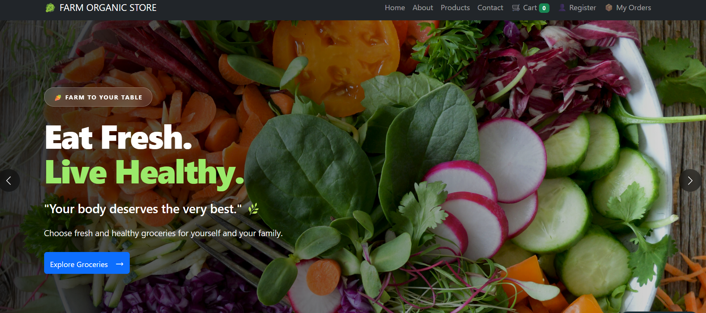
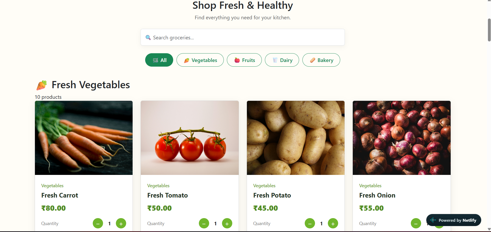
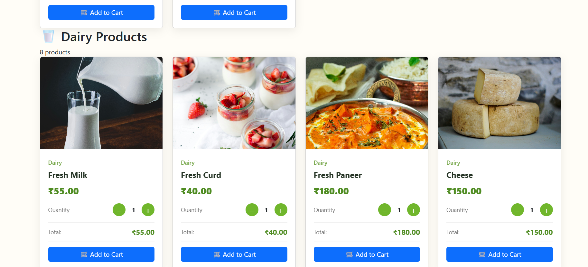
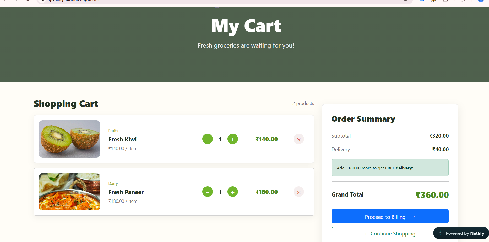
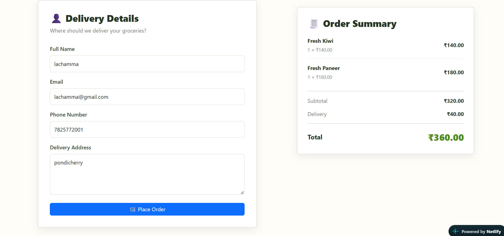
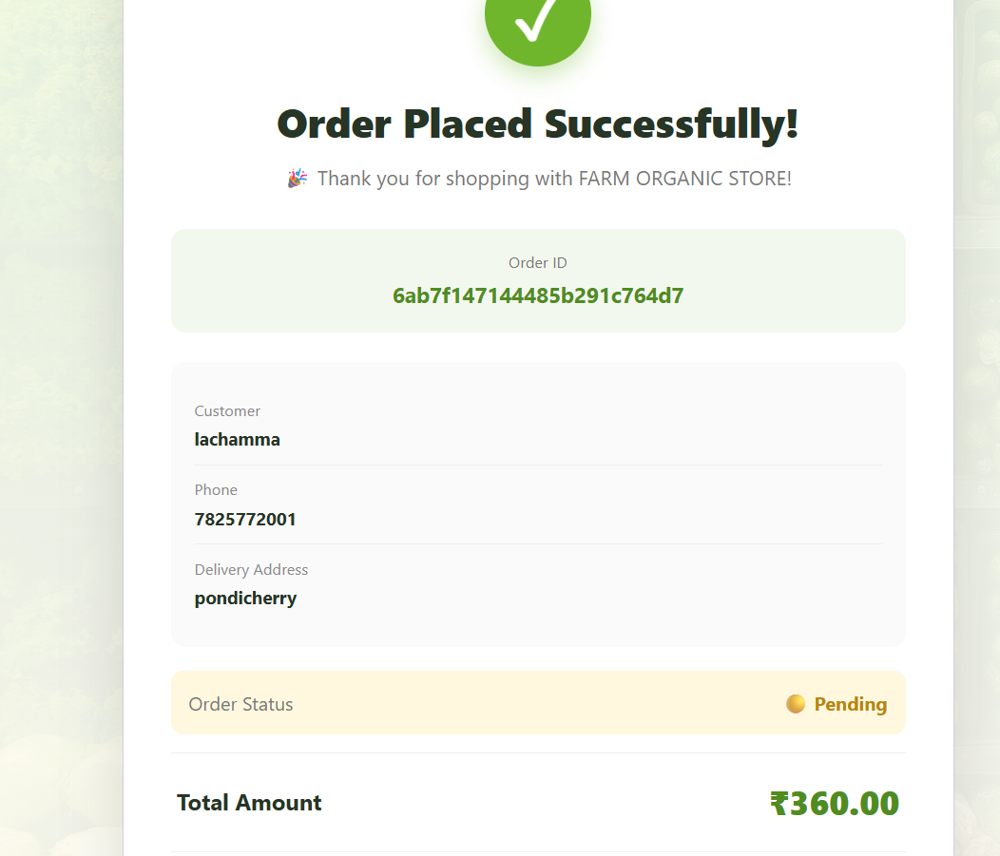
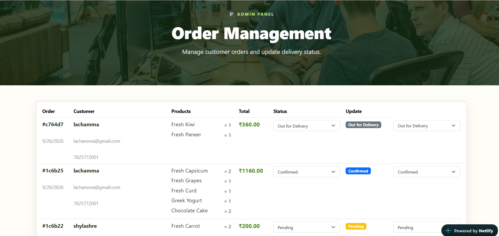

# 🛒 Grocery Shop App (MERN Stack)

A full-stack **MERN Grocery Shopping Application** built using **React, Node.js, Express.js, and MongoDB**. The application allows users to browse products, manage a shopping cart, register customers, place orders, and provides an admin interface for order management.

---

## 🚀 Project Overview

This project demonstrates a complete MERN Stack workflow—from building a responsive React frontend to creating REST APIs with Express and storing data in MongoDB. It includes both customer-facing features and an admin management interface.

### Key Highlights

* 🛍️ Dynamic product listing
* 🛒 Shopping cart with quantity management
* 👤 Customer registration
* 💳 Billing and checkout
* 📦 Order tracking
* 🛠️ Admin order management
* 📱 Fully responsive design

---

## 📸 Project Screenshots

### 🏠 Home Page

Premium grocery shopping landing page with a modern responsive interface.

<p align="center">
  
</p>

---

### 🛍️ Product Management

Browse products with dynamic pricing and category-based shopping.

<p align="center">
  
</p>

---

### 🍅 Product Details

View product information with quantity controls before adding items to the cart.

<p align="center">
  
</p>

---

### 🛒 Shopping Cart

Real-time cart updates with quantity increment and decrement functionality.

<p align="center">
  
</p>

---

### 💳 Checkout

Customer registration and billing process before placing an order.

<p align="center">
  
</p>

---

### 📦 My Orders

Track previously placed orders and view their status.

<p align="center">
  
</p>

---

### 🛠️ Admin Dashboard

Admin panel for monitoring and managing customer orders.

<p align="center">
  
</p>

---

## ✨ Features

* Dynamic product listing from MongoDB
* Shopping cart with real-time quantity updates
* Customer registration system
* Secure checkout workflow
* Order history tracking
* Admin order management
* REST API integration
* MongoDB database connectivity
* Responsive UI for desktop and mobile

---

## 🛠️ Tech Stack

| **Frontend** | **Backend** | **Database** |
| ------------ | ----------- | ------------ |
| React (Vite) | Node.js     | MongoDB      |
| Bootstrap    | Express.js  | Mongoose     |
| Axios        | REST API    |              |

---

## 📂 Project Structure

```text
grocery-shop-app/
├── lavsfe/        # React Frontend
├── lavsbe/        # Node + Express Backend
├── assets/        # README screenshots
└── README.md
```

---

## ⚙️ Installation

### Frontend

```bash
cd lavsfe
npm install
npm run dev
```

### Backend

```bash
cd lavsbe
npm install
node server.js
```

---

## 🔗 API Features

* Product API
* Customer Registration API
* Order API
* Admin Order Management API

---


* 💻 GitHub: github.com/abikshaw24
* 🔗 LinkedIn: linkedin.com/in/abikshaw-l-7a81612b4
* 📧 Email: [abikshaw24@gmail.com](mailto:abikshaw24@gmail.com)
